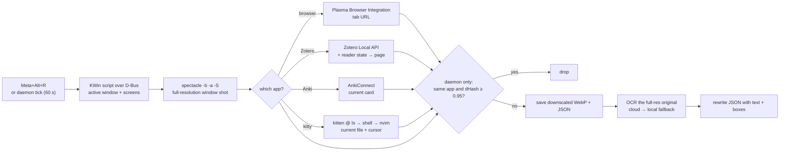

# linux_recall

A Windows Recall–style screen memory for **KDE Plasma 6 on Wayland**.
Every minute (or on a hotkey) it screenshots the active window and records *what you were looking at*:
the app, the window title, the browser URL, the paper and page open in Zotero, the Anki card under review,
the file open in Neovim (in kitty or Neovide), the last shell command and its output, the Claude Code session,
and the OCR'd text. Each capture is a small WebP plus a JSON file, searchable from the command line.
You can jump back to the source with one key: the web page, the PDF page in Zotero, the Anki card, the file and line in Neovim, or the kitty window.

[中文说明](README.zh-CN.md)

## Demo


https://github.com/user-attachments/assets/99fa2c02-1c16-431c-baca-bb3f1fdb6e25


## Features

- **Capture**: active window only, downscaled to logical pixels (about 150 KB per shot); hotkey `Meta+Alt+R` or a systemd user service every 60 s
- **Deduplication**: same app and a perceptually similar image (dHash) → the shot is dropped; every decision is logged with its similarity score
- **Context per app**:
  - browsers: URL of the active tab
  - Zotero: item, DOI, **current page**, and a `zotero://open-pdf/...?page=N` link
  - Anki: the card under review (or the Browse selection), with field text
  - kitty: the focused tab and window, its shell and foreground processes; the last command and its output (shell integration); for Neovim the open file, cursor and visible text; for Claude Code the session id, title and last prompt
  - Neovide: the same Neovim record as in kitty
- **OCR**: PaddleOCR cloud API (PP-OCRv6, Chinese + English), falling back to local RapidOCR on timeout or error
- **Search**: `jq` recipes and `lr`, an fzf picker with the matching line boxed in red on the screenshot (rendered inline in kitty), and `ctrl-o` to reopen the URL / PDF page / Anki card / Neovim file / kitty window
- **Click to Do**: `Meta+Alt+C` turns the active window into a page where the text in the screenshot is selectable word by word

## Why this is harder on Wayland

On X11, any client can read the window list, the focused window and any window's pixels.
Wayland deliberately removes all three, and KWin doesn't implement the generic protocols that
wlroots compositors offer (`wlr-screencopy`, `ext-image-copy-capture`, `ext-foreign-toplevel-list`).
That's why OpenRecall (`mss` → `XGetImage`) and screenpipe (`xcap`/XCB) only see XWayland windows on Plasma.

What linux_recall uses instead:

| Need | X11 way | What works on KWin Wayland (used here) |
|---|---|---|
| Focused window, its geometry, screens | `_NET_ACTIVE_WINDOW`, `xdotool` | A throw-away **KWin script** loaded over D-Bus |
| Screenshot | `XGetImage` | **Spectacle** in background mode (it's on KWin's screenshot whitelist) |
| Browser URL | read the window / X properties | **Plasma Browser Integration**'s D-Bus tab list |
| Global hotkey | `XGrabKey` | **kglobalaccel** over D-Bus |
| Idle / locked | `XScreenSaver` | `org.freedesktop.ScreenSaver.GetActive` |

## How it works



### Active window: a KWin script over D-Bus

Wayland has no API for "which window is focused", but KWin's scripting engine can see everything.
`kwin.py` writes a short JavaScript file that reads `workspace.activeWindow` and `workspace.screens`,
loads it with `org.kde.KWin /Scripting loadScript`, runs it, and the script calls back into our own
D-Bus connection with `callDBus(...)` carrying a JSON payload. Then the script is unloaded.
This is the same trick `kdotool` uses, but one round trip returns every field we need
(caption, app id, pid, geometry, output, per-screen scale) in about 50 ms.

### Screenshots: Spectacle, then downscale

KWin's `org.kde.KWin.ScreenShot2` only accepts callers listed in a whitelisted `.desktop` file,
so the tool runs `spectacle --background --nonotify --new-instance -a -S`:

- `-a -S` captures only the active window, without its transparent drop shadow
- `--new-instance` matters: Spectacle is single-instance over D-Bus, so without it a hotkey shot
  during a daemon shot gets forwarded to the first process and its `--output` is lost
- `--scaled` only works together with full-desktop mode, so HiDPI window shots are downscaled in Python

On a 2× screen a window shot is 3840 px wide, but **OCR runs on that full-resolution original**, and only the
copy that's kept is downscaled (÷ the output scale). OCR on the downscaled copy lost more than half the lines
of small terminal text (105 → 42). OCR boxes are then mapped to the saved image's pixels.

### Browser URL: Plasma Browser Integration

The browser extension exports all tabs through a KRunner interface
(`org.kde.plasma.browser_integration /TabsRunner`). It doesn't say which tab is active, so the window
caption (minus " — Mozilla Firefox") is matched exactly against tab titles. Two gotchas:
TabsRunner **caches the tab list until `Teardown()`** (otherwise you get stale titles), and tabs with
identical titles are recorded as `"match": "ambiguous"`. Private windows are skipped.

### Zotero: Local API + reader state

Zotero 7+ serves a read-only copy of its web API at `http://localhost:23119/api/`, but it has no endpoint for
"the open reader tab". The reader tab's window caption is `Title - Author - Year - Zotero`, so the tool searches
with `qmode=titleCreatorYear` and reads the current page from `storage/<attachment>/.zotero-reader-state`
(`pageIndex`, 0-based), which Zotero also keeps for linked files.
`ctrl-o` later opens `zotero://open-pdf/library/items/<attachment>?page=N`.

### Anki: AnkiConnect

While reviewing, `guiCurrentCard` + `cardsInfo` give the card, note, deck and fields; in the Browse window,
`guiSelectedNotes` gives the selection. Fields are stored as plain text, so card content is searchable.
`ctrl-o` calls `guiBrowse cid:<card>` and `guiSelectCard`, then raises the Browse window with `kdotool`,
because KWin's focus-stealing prevention blocks Anki from raising an already-open window itself.

### kitty and Neovim: remote control + msgpack-RPC

With `allow_remote_control yes` and `listen_on unix:/tmp/kitty` in `kitty.conf`, kitty listens on
`/tmp/kitty-<pid>` and exports that address to its children as `KITTY_LISTEN_ON`; the KWin window's pid is
kitty's, so the address is read from a child's `/proc/<pid>/environ`. `kitten @ ls` gives the tree
kitty → OS window → tab → window (the shell, e.g. zsh) → `foreground_processes` (what the shell is running).
Neovim is split into a TUI process and an `nvim --embed` server child (in its own process group, so kitty
doesn't list it); the server listens on `$XDG_RUNTIME_DIR/nvim.<server pid>.0`, and one
`nvim --server … --remote-expr` call (about 10–30 ms) returns the current file, cursor, mode, cwd, listed buffers,
and the exact text visible in every window of the current tabpage (lines `w0`..`w$` with their line numbers; plugin
UIs and secret-looking files such as `.env` or `~/.ssh/*` keep only the path). `lr` searches that text too and shows
matches as `file:line`, so `ctrl-o` jumps to the matching line rather than wherever the cursor was. OCR still runs,
for the statusline, other UI and the boxed preview.
`ctrl-o` goes back to it: if that Neovim is still running, it `:drop`s the file and sets the cursor over the same
socket, then `kitten @ focus-window` brings up its kitty window (buffers, splits and jumplist intact);
otherwise it opens `nvim +<line> <file>` in a new kitty tab. Neovide works the same way: its `nvim --embed` child is
the server, `ctrl-o` raises the Neovide window with `kdotool windowactivate <KWin internal id>`, or starts
`neovide -- +<line> <file>`. For other kitty captures, `ctrl-o` focuses the same kitty
window, or its tab if the window was closed (ids are never reused within a kitty process, and a restarted kitty
listens on a different `/tmp/kitty-<pid>`, so a stale id can't hit the wrong window).

With kitty's shell integration, `kitten @ ls` also reports each window's `last_reported_cmdline`, `at_prompt` and
`last_cmd_exit_status`, and `kitten @ get-text --extent last_cmd_output` returns that command's output, or the output
so far while it's still running: the exact terminal text, no OCR (the last 200 lines are kept; full-screen programs
and commands like `pass`, `gpg`, `printenv` or `cat .env` keep only the command line).
Claude Code writes `~/.claude/sessions/<pid>.json` (session id, cwd, status) for each running CLI; the end of the
transcript `~/.claude/projects/*/<session id>.jsonl` has the session's `ai-title` and `last-prompt`. If the kitty
window is gone, `ctrl-o` runs `claude --resume <session id>` in a new tab.

### OCR: cloud first, local fallback

- **Cloud**: the PaddleOCR API (PP-OCRv6, needs `PADDLEOCR_TOKEN`). It downscales detection input to 960 px and
  rejects anything above 4000 px, so a whole three-monitor desktop (6098 px wide) came back with 2 lines.
  Uploading just the window gives 100+ lines. A full queue (`code 10010`) is retried with backoff.
- **Local**: [RapidOCR](https://github.com/RapidAI/RapidOCR) (PaddleOCR models on ONNX Runtime), used when the
  cloud misses `--ocr-timeout` (default 60 s, covering the whole attempt) or errors. The JSON records which
  engine ran and why the fallback happened.

The JSON is written twice, atomically: right after the screenshot (`"ocr": null`) and again after OCR,
so a failed OCR never loses the capture.

### Deduplication: dHash

`similarity.py` computes a 256-bit difference hash; similarity is 1 − Hamming distance / 256.
Measured on this setup: identical 1.0, clock tick 0.988, one new line of text 0.977, a new paragraph 0.93,
300 px scroll 0.82, unrelated content 0.5–0.73. The daemon drops a shot when it's the same app as the last
saved one and similarity ≥ `--threshold` (0.95); an app switch is always kept, and nothing is taken while the
screen is locked or the active window is excluded (see [Privacy](#privacy)). Each cycle logs one line and appends to `~/.cache/linux_recall/daemon.jsonl`:

```
KEEP  kitty        similarity 0.543 (threshold 0.95)  changed  [kept 2, skipped 0]
SKIP  kitty        similarity 1.000 (threshold 0.95)  similar  [kept 2, skipped 1]
KEEP  firefox      similarity 0.612 (threshold 0.95)  app kitty -> firefox  [kept 3, skipped 1]
```

With active use it keeps close to one shot a minute, about 10 MB per active hour.

### Click to Do: selectable text over a screenshot

`Meta+Alt+C` screenshots the active window, OCRs it with per-word boxes, and opens an HTML page in Firefox:
the screenshot with an invisible text layer on top, built the way pdf.js does it. Every character is an
absolutely positioned `<span>`, stretched with `scaleX` to cover its box, and lines are ordered column by column,
so a drag doesn't pull in the sidebar. The cloud's word boxes are often off by several pixels (7 px median, a
whole word in the worst case), so `textfit.py` re-aligns every character to the actual ink in the screenshot,
using dynamic programming over glyph gaps.

## Install

Requirements: KDE Plasma 6 (Wayland), Python ≥ 3.12, [uv](https://docs.astral.sh/uv/), `spectacle`.
Optional: `plasma-browser-integration` plus its browser extension (URLs); Zotero 7+ with *Settings → Advanced →
Allow other applications on this computer to communicate with Zotero*; Anki with
[AnkiConnect](https://ankiweb.net/shared/info/2055492159); `PADDLEOCR_TOKEN` for cloud OCR;
`jq`, `fzf`, ImageMagick and kitty for search.

```sh
git clone https://github.com/junyixu/linux_recall ~/WorkSpace/windows_recall_linux
cd ~/WorkSpace/windows_recall_linux
uv sync
./scripts/install-hotkey.sh          # Meta+Alt+R: capture, Meta+Alt+C: Click to Do

# optional: capture every minute
cp systemd/linux-recall.service ~/.config/systemd/user/   # edit ExecStart if you cloned elsewhere
systemctl --user daemon-reload && systemctl --user enable --now linux-recall
```

Put `PADDLEOCR_TOKEN=...` in `~/.config/environment.d/*.conf` so the hotkey and the service see it.
Without it, OCR is local only.

## Usage

```sh
uv run linux-recall-capture                     # one capture (what the hotkey runs)
uv run linux-recall-capture --mode fullscreen   # whole desktop; OCR still only the active window
uv run linux-recall-capture --full-res          # keep HiDPI resolution
journalctl --user -u linux-recall -f -o cat     # watch the daemon's keep/skip decisions
```

Captures live in `~/.local/share/linux_recall/captures/YYYY-MM-DD/<id>.{webp,json}`;
logs and caches in `~/.cache/linux_recall/`.

### Search

```sh
source scripts/lr.zsh      # in ~/.zshrc

lr lunar                   # fzf: app + time │ matching line, keyword in red │ site / paper / deck
                           #   preview: screenshot with the match boxed (kitty), enter: print the JSON path,
                           #   ctrl-f: print the file open in Neovim (app shows as kitty(neovim)), ctrl-s: open image,
                           #   ctrl-o: reopen the URL / Zotero page / Anki card / Neovim file and line / kitty window
lr-search 截图保存          # plain TSV: time, app, URL or title, image path
lr-highlight <capture.json> lunar   # PNG with matching lines boxed
```

Or query the JSON directly:

```sh
cd ~/.local/share/linux_recall/captures
jq -r --arg q lunar '
  select([.ocr.text, .window.caption, .browser.url] | map(. // "") | join("\n")
         | ascii_downcase | contains($q | ascii_downcase))
  | [.captured_at[:19], .window.app_name, (.browser.url // .window.caption)] | @tsv' */*.json
```

More recipes (timelines, per-app filters, papers read, dedup statistics): [README.zh-CN.md](README.zh-CN.md).

### Capture format (abridged)

```jsonc
{
  "schema_version": 10,
  "captured_at": "2026-09-23T20:51:42.366+02:00",
  "trigger": "timer",                                   // or "hotkey"
  "screenshot": {"file": "….webp", "mode": "window", "width": 1969, "height": 1068,
                 "scale": 0.5128, "dhash": "…"},
  "window":  {"app_name": "Firefox", "caption": "…", "desktop_file": "firefox", "pid": 2770, "output": "DP-1"},
  "browser": {"url": "https://…", "match": "exact"},    // null unless a browser
  "zotero":  {"title": "…", "doi": "…", "page": 48,
              "open_link": "zotero://open-pdf/library/items/I2R4MPPK?page=48"},
  "anki":    {"mode": "review", "card_id": 1706122964826, "deck": "…", "fields": {"Front": "…"},
              "browse_query": "cid:1706122964826"},
  "kitty":   {"address": "unix:/tmp/kitty-7201", "tab": {"id": 35, "title": "…"}, "window": {"id": 37, "pid": 16134, "cmdline": ["/bin/zsh"], "cwd": "…"},
              "foreground_processes": [{"pid": 98870, "cmdline": ["nvim"], "cwd": "…"}],
              "nvim": {"pid": 98870, "server_pid": 98871, "file": "/…/notes.md", "line": 17, "col": 1,
                       "filetype": "markdown", "modified": false, "mode": "n", "cwd": "…", "buffers": ["…"],
                       "windows": [{"file": "/…/notes.md", "buftype": "", "current": true, "first": 3,
                                    "lines": ["line 3 of the file", "line 4", "…"]}]},
              "shell":  {"cmdline": "make test", "at_prompt": true, "exit_status": 1, "output_lines": 312,
                         "output": ["… the last 200 lines …"]},
              "claude": {"session_id": "c26e9654-…", "cwd": "…", "status": "busy", "title": "…", "last_prompt": "…",
                         "transcript": "~/.claude/projects/…/c26e9654-….jsonl"}},
  "neovide": {"nvim": {"file": "…", "line": 17, "windows": […]}},   // null unless Neovide
  "ocr":     {"engine": "paddleocr-cloud PP-OCRv6", "fallback_reason": null,
              "text": "…", "lines": [{"text": "…", "score": 0.99, "box": [[x, y], …]}]}
}
```

## Privacy

Everything is stored **unencrypted** on your disk, and cloud OCR uploads the window image to Baidu AI Studio.
A small exclusion list (`linux_recall/exclude.py`) is checked right after the KWin query, before Spectacle runs, so
nothing of those windows is ever written: password managers (KeePassXC, Bitwarden, 1Password, KWallet), auth prompts
(polkit, ksshaskpass, pinentry), Spectacle's own region-select overlay (a frozen image of the whole desktop), and
windows whose caption contains `Private Browsing`, `(Incognito)`, `(Private)` or `[InPrivate]`, and browser tabs on listed
domains (`SITES`, e.g. a bank; the URL lookup moved ahead of the screenshot for this). Only the active window is
checked, and a site is only caught when Plasma Browser Integration reports the URL, so review what you record.
Unset `PADDLEOCR_TOKEN` in `environment.d` to keep OCR local.

## Status

A personal tool, built and tested on Arch Linux + Plasma 6.7 with three mixed-DPI monitors.
Next up: SQLite FTS5 index, event-driven triggers (window switch, `ext-idle-notify-v1`), expiring old images while
keeping the JSON, and encryption.

## Similar projects

- **Windows Recall** (Microsoft, Copilot+ PCs): the original idea; Windows only.
- [OpenRecall](https://github.com/openrecall/openrecall): open-source Recall clone in Python (AGPL-3.0).
  Captures with `mss`, which fails with `XGetImage() failed` on a Wayland session.
- [screenpipe](https://github.com/screenpipe/screenpipe): event-driven capture, accessibility tree plus OCR,
  SQLite full-text search. Now source-available rather than open source; on Linux it captures through X11,
  so it only sees XWayland windows on Plasma.
- [Windrecorder](https://github.com/yuka-friends/Windrecorder): records and OCRs the screen; Windows only.
- [ActivityWatch](https://activitywatch.net/): tracks app and window usage time without screenshots;
  on KWin Wayland it needs [awatcher](https://github.com/2e3s/awatcher).
- [NormCap](https://github.com/dynobo/normcap): one-off "select a region, copy its text" OCR, which works on Wayland.
  It's the closest to Click to Do.
